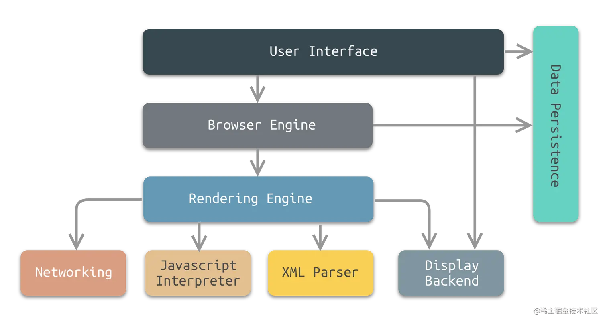

# 一.浏览器的组成

## 1.常见的浏览器内核有哪些？
**浏览器的内核分成两部分：**
`渲染引擎`和`JS引擎`（注意🚧我们常说的浏览器内核就是指JS引擎）

FireFox 和 Chrome 使用不同的渲染引擎和 JavaScript 引擎：

1. **FireFox**:
   - **渲染引擎**: Gecko
   - **JavaScript 引擎**: SpiderMonkey

2. **Chrome** (以及大多数基于Chromium的浏览器，如新的Microsoft Edge)：
   - **渲染引擎**: Blink (注意：Blink是从WebKit分叉出来的，WebKit是早期Chrome和现在的Safari使用的渲染引擎)
   - **JavaScript 引擎**: V8

## 2.浏览器的主要组成部分有哪些？

浏览器是一个复杂的应用程序，其主要组件如下：

1. **用户界面 (User Interface)**: 这部分包括地址栏、书签栏、前进/后退按钮、刷新按钮等。简而言之，除了您在浏览页面时看到的内容外，用户界面包括了其他所有部分。

2. **浏览器引擎 (Browser Engine)**: 该模块在用户界面和渲染引擎之间起到中介的作用，传递命令。

3. **渲染引擎 (Rendering Engine)**: 负责显示请求的内容。如果请求的是HTML内容，渲染引擎就负责解析HTML和CSS，并将解析后的内容显示在屏幕上。

4. **网络 (Networking)**: 用于网络调用，例如HTTP请求。它负责发送查询和下载网页、图片、其他资源。

5. **JavaScript解释器 (JavaScript Engine)**: 解析和执行JavaScript来实现网页的动态功能。

6. **数据存储 (Data Storage)**: 这是持久层。浏览器需要在本地存储各种数据，如cookies。HTML5引入了web storage，允许网页本地存储数据。

**交互流程**：

1. 当您在地址栏中输入URL并按下Enter时，**用户界面**指示**浏览器引擎**加载请求的网页。
   
2. **浏览器引擎**告知**网络模块**获取该URL的内容。

3. 一旦**网络模块**完成下载网页的主要内容（通常是HTML文件），它将数据传递给**渲染引擎**。

4. **渲染引擎**开始解析HTML，并在解析过程中遇到其他资源（如CSS文件、JavaScript文件或图片）时请求**网络模块**加载它们。

5. 如果渲染引擎在解析HTML时遇到JavaScript，并且JavaScript没有被**延迟或异步加载（deffer\async异步加载js）**，则**渲染引擎暂停HTML解析并将控制权交给JavaScript引擎**。一旦JavaScript引擎完成执行，控制权返回渲染引擎。

6. **DOM 构建**: 当浏览器开始接收到HTML内容时，它会开始构建DOM（Document Object Model）。DOM是一个树形结构，表示页面的内容结构。DOM的构建是逐步的，也就是说，**当浏览器接收到HTML内容的一部分时，它就开始构建DOM的这一部分。**

7. **CSSOM 构建**: 同时，当浏览器遇到外部CSS文件（通过`<link>`标签）或内部样式（通过`<style>`标签）时，它开始构建另一个树结构，称为CSSOM（CSS Object Model）。CSSOM表示样式规则及其如何应用到DOM上。

8. **渲染树 构建**: 一旦浏览器有了DO**M和CSSOM，它会结合这两者来创建渲染树。渲染树只包含在页面上可见的元素**以及这些元素的样式。

9. **布局**: 当渲染树被创建并完成之后，浏览器开始了布局过程，也被称为"reflow"。这是**计算每个可见元素的大小和位置**的过程。

10. **绘制**: 经过布局之后，浏览器会开始绘制页面，将每个元素**渲染到屏幕**上。

⚠️注意：与大多数浏览器不同的是，谷歌（Chrome）浏览器的每个标签页都分别对应一个渲染引擎实例。每个标签页都是一个独立的**进程（进程和线程）**

## 3.什么是DOM（文档对象模型）与BOM有什么区别？浏览器是如何使用DOM来表示文档的？
DOM通常被视为**多叉树（或称为n-叉树）**。这意味着每个节点可能有零个、一个或多个子节点。实际上，一个DOM元素节点的子节点数量是没有限制的。例如，一个`
`元素内部可能包含多个其他的元素，如`
`, `<a>`, ``等。

DOM是文档对象模型（Document Object Model）是一个**用于HTML和XML文档的编程接口**。DOM以树状模型表示文档的结构，树中的每个节点代表文档中的元素、属性或文本片段。开发者可以**使用DOM API动态地操作网页的内容、结构和样式**。

而BOM是**浏览器对象模型（Browser Object Model）的缩写**。它是一个编程接口，代表了**浏览器的各个组件**，如**window对象**、**location对象**、**history对象**等等。BOM提供了方法和属性来与浏览器窗口进行交互，处理**导航，操作浏览器历史，显示对话框，以及控制框架和窗口**等功能。

DOM和BOM的主要区别在于它们的作用范围。DOM主要用于**操作网页的结构和内容**，允许开发者访问和修改HTML元素、属性和文本节点。而BOM则涉及**浏览器窗口及其组件**，提供了控制浏览器行为和与用户交互的方法和属性。