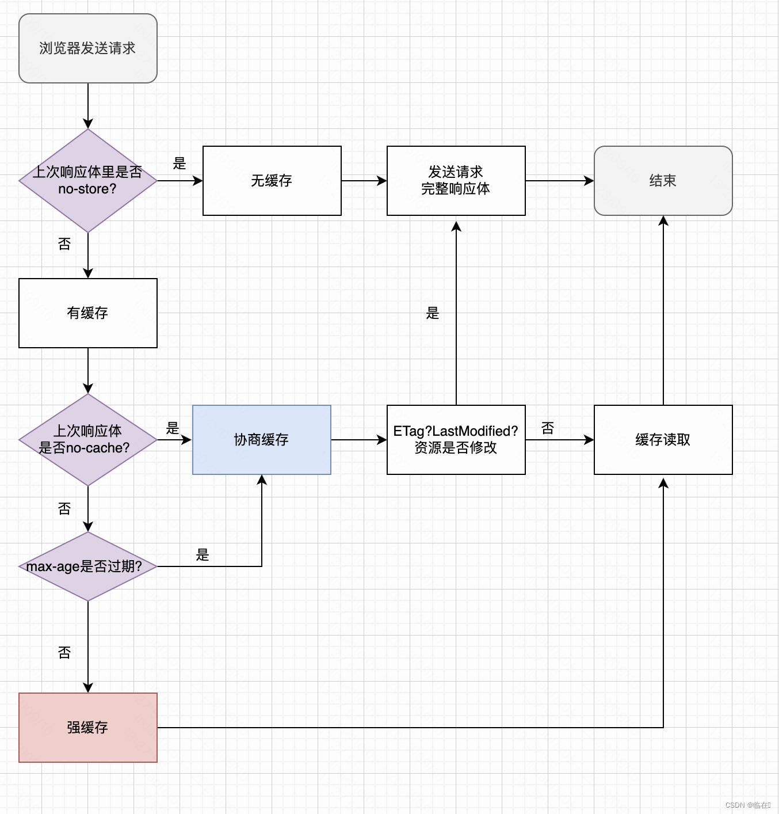

# 三、浏览器的存储-缓存机制
## 1.说一说浏览器的缓存机制？

**认识浏览器缓存：**
当浏览器请求一个网站时，会加载各种资源，对于一些**不经常变动的资源**，浏览器会将他们保存在本地内存中，下次访问时直接加载这些资源，提高访问速度。

**浏览器缓存分类：**

 - 强缓存：**不会**发请求给服务器，直接从本地缓存读取，返回状态码是200（from cache）。
 - 协商缓存：**会**发请求给服务器，**比对资源是否有变化**，如果没有变化，返回状态码是304（not modified），然后从本地缓存读取。

**什么样的资源使用强缓存，什么样的资源使用协商缓存？**

 1. 使用强缓存的资源：不经常变化的资源（例如 CSS、JavaScript 文件，图片、视频等）

 2. 使用协商缓存的资源：经常变化的资源（例如来自数据库的内容、新闻、博客帖子等，它们可能经常变化）

**如何实现强缓存？**
设置Expires与Cache-Control，Expires逐渐被Cache-Control取代。

 1. Cache-Control：控制缓存字段，后端配置，常见的取值包括：

 - public：表示资源可以**被任何缓存**（包括浏览器和CDN）缓存。
 - private：表示资源只能被**单个用户的私有缓存**缓存，不能被共享缓存（如CDN）缓存。
 - no-cache：强制使用协商缓存，即每次请求都要与服务器确认资源是否有更新。
 - no-store:不使用缓存，每次重发请求，包括请求响应体。
 - max-age=<seconds：用来设置强缓存，表示资源的**有效期**，即从请求时间开始，缓存会在指定的秒数内有效。
 - s-maxage=<seconds：类似于 max-age，但仅适用于共享缓存（如CDN）。

2. Expires：这是一个过时的字段，被 Cache-Control 所取代。它指定了一个**绝对的过期日期**，由于客户端与服务器端的时间不同，可能存在不准确的问题。

**如何实现协商缓存？**

1. Cache-Control中的no-cache
2. Last-Modified / If-Modified-Since
3. ETag（哈希值） / If-None-Match

后面两种方法通常与`Cache-Control`指令一起使用。

**与缓存相关的配置方法：**

**请求头(Request Headers)：**
1. **`If-None-Match`**: 等于上次服务器响应体中的ETag值，询问服务器资源是否被修改。
2. **`If-Modified-Since`**: 询问资源是否过期。
3. **`Cache-Control`**: 指明了资源如何被缓存的指令，例如`max-age`, `no-cache`, `private`, `public`等。

**响应头(Response Headers)：**
4. **`Cache-Control`**: 指明了资源如何被缓存的指令，例如`max-age`, `no-cache`, `private`, `public`等。
   
5. **`Expires`**: 设置资源过期的绝对时间。

6. **`ETag`**: 服务器为资源生成的一个标识符。

7. **`Last-Modified`**: 表示资源最后一次被修改的时间。

8. **`Vary`**: 告诉缓存机制哪些请求头部信息应该被考虑进去。

**缓存完整流程图：**

## 2.浏览器的存储（新）

浏览器提供了多种客户端存储机制，每种机制都有其特定的用途、特性和限制。以下是对 `cookie`、`localStorage`、`sessionStorage` 和 `IndexedDB` 的对比：

**1. Cookie**

- **存储大小**: 通常限制为4KB。
- **生命周期**: 可以设置过期时间。如果没有设置，它的生命周期将与会话持续相同，即关闭浏览器后会被删除。
- **与服务器交互**: 每次HTTP请求都会附带，这可能会浪费带宽。
- **访问性**: JavaScript可以访问，但需要考虑安全性（例如：设置`HttpOnly`标志以防止通过JS访问）。
- **使用场景**: 适合小量数据的存储，经常用于身份验证（如存储JWT或会话ID）。

**2. LocalStorage**

- **存储大小**: 通常限制为5-10MB。
- **生命周期**: 没有过期时间，除非明确删除，否则数据会永久存储。
- **与服务器交互**: 数据只在客户端存储，不会随每次请求发送给服务器。
- **访问性**: 可以通过JavaScript访问。
- **使用场景**: 适合大量持久化的数据，如用户偏好设置、主题等。

**3. SessionStorage**

- **存储大小**: 通常限制为5-10MB。
- **生命周期**: 数据在页面会话期间可用，关闭页面或浏览器后会被清除。
- **与服务器交互**: 数据只在客户端存储，不会随每次请求发送给服务器。
- **访问性**: 可以通过JavaScript访问。
- **使用场景**: 适合需要在浏览器会话中临时存储的数据。

**4. IndexedDB**

- **存储大小**: 无明确的限制，但可能受到磁盘空间的影响。通常可以存储大量数据。
- **生命周期**: 没有过期时间，除非明确删除，否则数据会永久存储。
- **与服务器交互**: 数据只在客户端存储，不会随每次请求发送给服务器。
- **访问性**: 可以通过JavaScript访问。
- **结构**: 它是一个事务性的数据库系统，可以存储键值对，支持索引，事务和游标。
- **使用场景**: 适合大量数据的存储，如离线应用数据、大数据集等。

**总结**

- **大小**: `cookie` < `localStorage/sessionStorage` << `IndexedDB`
- **生命周期**: `sessionStorage` < `cookie` (如果设置了过期时间) = `localStorage` = `IndexedDB`
- **与服务器交互**: 只有`cookie`会随HTTP请求自动发送。
- **结构**: 只有`IndexedDB`提供了数据库的功能和结构。
- **用途**: 根据存储需求和数据的大小、持续性来选择合适的存储机制。

**5.使用localStorage注意事项和限制**：
使用`localStorage`时，有以下注意事项和限制需要考虑：

1. 容量限制：`localStorage`的存储容量通常为5MB到10MB，不同浏览器可能有略微不同的限制。超过容量限制时，将无法继续往`localStorage`中存储数据。

2. 数据格式限制：`localStorage`只能存储字符串类型的数据。如果需要存储其他数据类型（如对象、数组等），需要先将其转换为字符串形式（如使用`JSON.stringify()`方法），再存储到`localStorage`中，并在读取时进行相应的解析（如使用`JSON.parse()`方法）。

3. 同源策略：`localStorage`受到同源策略的限制，即只能在同一个域名下的页面之间进行数据共享。每个域名都拥有独立的`localStorage`存储空间，不同域名之间的`localStorage`无法相互访问。

4. 持久性：`localStorage`的数据将一直保留在客户端，除非主动删除或浏览器清除缓存。即使关闭浏览器或重新启动设备，数据仍然会保留。

5. 安全性：由于`localStorage`存储在客户端，因此数据可能面临一定的安全风险。恶意脚本可能尝试读取或篡改`localStorage`中的数据。为了保护敏感信息，应该避免在`localStorage`中存储敏感数据，或者对敏感数据进行加密处理。

6. 性能影响：频繁读写大量数据到`localStorage`可能会对页面性能产生影响。过多的数据读写操作可能导致页面响应变慢。

7. 不支持跨线程访问：`localStorage`只能在主线程中使用，无法在Web Worker等其他线程中访问。

8. 不支持事务和查询：`localStorage`并不适合用于处理复杂的数据查询和事务操作。它是一个简单的键值存储系统，没有提供复杂的查询语言或事务处理机制。

考虑到这些注意事项和限制，使用`localStorage`时应谨慎处理数据类型、数据量和安全性，并确保符合同源策略和性能需求。在一些复杂的场景下，可能需要考虑使用其他技术或存储方案来满足需求。

