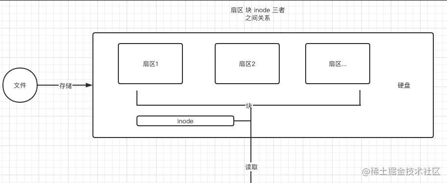

## 解释一下 npm 模块安装机制是什么？

npm 会检查本地的 node_modules 目录中是否已经安装过该模块，如果已经安装，则不再重新安装
npm 检查缓存中是否有相同的模块，如果有，直接从缓存中读取安装
如果本地和缓存中均不存在，npm 会从 registry 指定的地址下载安装包，然后将其写入到本地的 node_modules 目录中，同时缓存起来。

以下是对这段内容的分析和修正后的 Markdown 格式输出：

## npm 包开发注意事项及利用 Webpack 构建优化

### 一、npm 打包注意事项
1. 支持 CommonJS 模块化规范，打包后的结果应遵守该规则。
2. 考虑 npm 模块使用者的环境可能不支持 ES6，打包结果最好是采用 ES5 编写的，且如果 ES5 是经过转换的，最好连同 SourceMap 一同上传。
3. npm 包大小应尽量小，一些仓库可能会限制包大小。
4. 发布的模块不能将依赖的模块一同打包，应让用户选择性自行安装，避免模块应用者再次打包时出现底层模块被重复打包的情况。
5. UI 组件类的模块应将依赖的其他资源文件（如.css 文件）包含在发布的模块里。

### 二、利用 Webpack 进行构建优化
1. **CommonJS 模块化规范解决方案**：设置`output.libraryTarget='commonjs2'`使输出的代码符合 CommonJS2 模块化规范，以供其他模块导入使用。
2. **输出 ES5 代码解决方案**：使用`babel-loader`把 ES6 代码转换成 ES5 的代码，再通过开启`devtool: 'source-map'`输出 SourceMap 以便发布调试。
3. **减小 npm 包大小解决方案**：Babel 在把 ES6 代码转换成 ES5 代码时会注入一些辅助函数，导致每个输出文件中都包含这段辅助函数的代码，造成代码冗余。解决方法是修改`.babelrc`文件，为其加入`transform-runtime`插件。
4. **不将依赖模块打包到 npm 模块中解决方案**：使用`externals`配置项来告诉 webpack 哪些模块不需要打包。
5. **对于依赖的资源文件打包解决方案**：通过`css-loader`和`ExtractTextPlugin`来实现。配置如下：
```javascript
const ExtractTextPlugin = require('extract-text-webpack-plugin');

module.exports = {
  module: {
    rules: [
      {
        // 增加对 CSS 文件的支持
        test: /\.css/,
        // 提取出 Chunk 中的 CSS 代码到单独的文件中
        use: ExtractTextPlugin.extract({
          use: ['css-loader']
        }),
      },
    ]
  },
  plugins: [
    new ExtractTextPlugin({
      // 输出的 CSS 文件名称
      filename: 'index.css',
    }),
  ],
};
```


## 文件的本质

在讲解软/硬链接之前，需先了解 Linux 系统中的一个重要概念——inode。

文件存储在硬盘上，硬盘的最小存储单位是“扇区”（Sector），每个扇区存储 512 字节。而操作系统读取硬盘时，不会逐个扇区读取，效率太低，而是一次性连续读取多个扇区，这种一次性读取的连续多个扇区就是“块”（block）。常见的“块”大小为 4KB，即由连续八个 sector 组成一个 block。文件数据都储存在“块”中。

同时，还必须有一个地方储存文件的元信息，如文件的创建者、创建日期、大小等。这个储存文件元信息的区域就叫做 inode，中文译名为“索引节点”。

::: warning 注意
打开一个文件时，系统首先找到文件名对应的 inode 号码，然后通过 inode 号码获取 inode 信息，再根据 inode 信息中的文件数据所在 block 读出数据。
:::

上述概念的文章内容比较多，不太容易记忆，看图！




## inode 中包括了哪些内容 ？
inode包含文件的元信息，具体来说有以下内容：

文件的字节数
文件拥有者的User ID
文件的 Group ID
文件的读、写、执行权限
文件的时间戳，共有三个：ctime 指 inode上一次变动的时间，mtime 指文件内容上一次变动的时间，atime 指文件上一次打开的时间。
链接数，即有多少文件名指向这个 inode
文件数据 block 的位置

## Linux 命令获取文件的 inode 信息

可以直接使用 Linux 命令`stat`查看某个文件的 inode 信息。

示例：
```shell
stat example.js
```

输出信息如下：
```
16777223 11904170 -rw-r--r-- 1 koala staff 0 0 "Mar 24 13:46:08 2021" "Mar 24 13:46:08 2021" "Mar 24 13:46:26 2021" "Mar 24 13:46:08 2021" 4096 0 0x40 example.js
```

## Node.js 中获取文件的 inode 信息

在 Node.js 中，`fs`模块提供了`stat`函数来查看文件相关信息。

示例代码：
```javascript
fs.statSync('./example.js');
```

输出信息如下：
```
文件信息 Stats {
  dev: 16777223,
  mode: 33188,
  nlink: 1,
  uid: 501,
  gid: 20,
  rdev: 0,
  blksize: 4096,
  ino: 11904170,
  size: 0,
  blocks: 0,
  atimeMs: 1616564768255.48,
  mtimeMs: 1616564768255.48,
  ctimeMs: 1616564786778.5532,
  birthtimeMs: 1616564768255.48,
  atime: 2021-03-24T05:46:08.255Z,
  mtime: 2021-03-24T05:46:08.255Z,
  ctime: 2021-03-24T05:46:26.779Z,
  birthtime: 2021-03-24T05:46:08.255Z
}
```

每一个 inode 都有一个唯一的标识码，上面的输出信息中`ino`就是 inode 的唯一标识码。在 Linux 系统内部使用 inode 的标识码来识别文件，并不使用文件名。

在 Linux 系统中，目录也是一种文件。目录文件包含一系列目录项，每一个目录项由两部分组成：所包含文件的文件名，以及文件名对应的 inode 标识码。我们可以使用`ls -i`来列出目录中的文件以及所有的 inode 标识码。这也可以解释一个可能让小伙伴们觉得说不通的问题，即仅修改目录的读权限，并不能实现读取目录下所有文件内容的原因，最后需要通过递归目录下的文件来进行修改。

## 软链接与硬链接

什么是软链接(soft link,也叫符号链接)

软链接类似于 `Window` 中的 “快捷方式” 。创建软链接会创建一个新的 `inode`，比如为文件 `a` 创建了软链接文件b，文件 `b` 内部会指向 `a` 的 inode。当我们读取文件b的时候，系统会自动导向文件 `a` ，文件 `b` 就是文件 `a` 软连接(或者叫符号链接)。

- 访问：创建了软链接后我们就可以使用不同的文件名访问相同的内容，
- 修改：修改文件 `a` 的内容，文件 `b` 的内容也会发生改变，对文件内容的修改向放映到所有文件。
- 删除：当我们删除源文件 `a` 时，在访问软连接文件`b`是，会报错 `"No such file or directory"`

可以直接使用 `linux` 命令 `ln -s source target` 来创建软链接(注意：表示 `target` "指向" `source`)。

```shell
ln -s ./target/a.js b.js
```
执行 `shell` 命令后，会出现 `b.js` 文件，软链接创建成功。


## 什么是硬链接(hard link)

一般情况，一个文件名"唯一"对应一个 `inode`。但是 `linux` 允许多个文件名都指向同一个 `inode`。表示我们可以使用不同对文件名访问同样的内容；对文件内容进行修改将放映到所有文件；删除一个文件不影响另一个文件对访问。这种机制就被称为"硬链接"

## 硬链接的创建
可以直接使用 `linux` 命令 `ln source target` 来创建硬链接（注意：`source` 已存在的文件，`target` 是将要建立的链接）
```shell
ln ./target/a.js c.js
```
执行 `shell` 命令后，会出现 `c.js` 文件，硬链接创建成功。


::: warning 注意
与软连接不同，只能给文件建立硬链接，不能给目录建立硬链接。并且source文件必须存在，否则创建硬链接时会报错。
:::

删除一个文件不会影响另一个文件的访问。原因是什么？
实际上，文件 `inode` 中还有一个链接数的信息，每多一个文件指向这个 `inode`，该数字就会加 1，每少一个文件指向这个 `inode`，该数字就会减 1，当值减到 0，系统就自动回收 `inode` 及其对应的 `block` 区域。很像是一种引用计数的垃圾回收机制。
当我们对某个文件建立了硬链接后，对应的 `inode` 的链接数会是2（原文件本身已经有一个指向），当删除一个文件时，链接数变成 1，并没达到回收的条件，所以我们还是可以访问文件。

## npm 2 和 npm 3 模块安装机制的差异
虽然目前最新的 `npm` 版本是 `npm 6`，但 `npm 2` 到 `npm 3` 的版本变更中实现了目录打平，与其他版本相比差别较大。因此，让我们具体看下这两个版本的差异。

`npm 2` 在安装依赖包时，采用简单的递归安装方法。执行 `npm install` 后，`npm` 根据 `dependencies` 和 `devDependencies` 属性中指定的包来确定第一层依赖，`npm 2` 会根据第一层依赖的子依赖，递归安装各个包到子依赖的 `node_modules` 中，直到子依赖不再依赖其他模块。执行完毕后，我们会看到 `./node_modules` 这层目录中包含有我们 `package.json` 文件中所有的依赖包，而这些依赖包的子依赖包都安装在了自己的 `node_modules` 中 ，形成类似于下面的依赖树：


这样的目录有较为明显的好处：

1）层级结构非常明显，可以清楚的在第一层的 `node_modules` 中看到我们安装的所有包的子目录；

2）在已知自己所需包的名字以及版本号时，可以复制粘贴相应的文件到 `node_modules` 中，然后手动更改`package.json` 中的配置；

3）如果想要删除某个包，只需要简单的删除 `package.json` 文件中相应的某一行，然后删除 `node_modules` 中该包的目录；

但是这样的层级结构也有较为明显的缺陷，当我的 `A，B，C` 三个包中有相同的依赖 `D` 时，执行 `npm install` 后，`D` 会被重复下载三次，而随着我们的项目越来越复杂，`node_modules` 中的依赖树也会越来越复杂，像 `D` 这样的包也会越来越多，造成了大量的冗余。在 `windows` 系统中，甚至会因为目录的层级太深导致文件的路径过长，触发文件路径不能超过 `280` 个字符的错误。

为了解决以上问题，`npm 3` 的 `node_modules` 目录改成了更为扁平状的层级结构，尽量把依赖以及依赖的依赖平铺在 `node_modules` 文件夹下共享使用。

`npm3` 对于同一依赖的不同版本会怎么处理呢？
`npm 3` 会遍历所有的节点，逐个将模块放在 `node_modules` 的第一层，当发现有重复模块时，则丢弃， 如果遇到某些依赖版本不兼容的问题，则继续采用 `npm 2` 的处理方式，前面的放在 `node_modules` 目录中，后面的放在依赖树中。举个🌰：`A，B`，依赖 `D(v 0.0.1)`，`C` 依赖 `D(v 0.0.2)`:

但是 `npm 3` 会带来一个新的问题：由于在执行 `npm install` 的时候，按照 `package.json` 里依赖的顺序依次解析，上图如果 `C` 的顺序在 `A，B` 的前边，`node_modules` 树则会改变，会出现下边的情况：

由此可见，`npm 3` 并未完全解决冗余的问题，甚至还会带来新的问题。

## 为什么会出现 package-lock.json 呢？

为什么会有`package-lock.json`文件呢？这要从`package.json`的不足说起。

`package.json`不足之处在于，`npm install`执行后生成的`node_modules`树在很多情况下无法保证对于同一个`package.json`总是完全相同。原因有二：一是某些依赖项可能发布新版本，导致不同人安装时版本不同可能引发 bug；二是固定版本只能固定项目自身第一层依赖版本，间接依赖的包版本无法固定。

为解决此问题及`npm 3`的问题，`npm 5.0`后`npm install`会自动生成`package-lock.json`文件。有此文件时，`npm install`若`package.json`和`package-lock.json`版本兼容则按`package-lock.json`版本下载；不兼容则更新`package-lock.json`后下载。这样既保证`package-lock.json`版本兼容`package.json`，又确保其版本号与`node_module`下实际包版本一致。

`package-lock.json`锁定所有模块版本号，执行`npm install`时，Node 从`package.json`读模块名称，从`package-lock.json`获取版本号下载或更新。只有用特定命令安装才会更新模块及`package-lock.json`版本号。若`package.json`与`package-lock.json`都不存在，执行`npm install`会生成`package-lock.json`，但不会生成`package.json`，可通过`npm init --yes`初始化生成`package.json`。

以下是精炼后的内容：

## package-lock.json 文件的作用

### 一、确保团队依赖版本一致
在团队开发中，package-lock.json 可确保每个团队成员安装的依赖版本一致，确定唯一的`node_modules`树。

### 二、便于回溯目录状态
`node_modules`目录不提交到代码库，但 package-lock.json 可以提交。开发人员若想回溯到某一天的目录状态，只需将`package.json`和 package-lock.json 回退到那一天即可。

### 三、清晰了解依赖树结构及变化
由于 package-lock.json 与`node_modules`中的依赖嵌套完全一致，能更清楚地了解依赖树的结构及其变化。

### 四、优化安装过程
在安装时，npm 会比较`node_modules`已有的包与 package-lock.json，如果重复则跳过安装，优化安装过程。

## package-lock.json 文件的结构
文件中的`name`、`version`与`package.json`中的对应项一样，描述当前包的名字和版本。`dependencies`是一个对象，与`node_modules`中的包结构一一对应，其 key 为包的名称，值为包的描述信息。主要结构如下：
- `version`：包版本，即当前安装在`node_modules`中的版本。
- `resolved`：包具体的安装来源。
- `integrity`：包的 hash 值，用于验证已安装的软件包是否被改动过或失效。
- `requires`：对应依赖的依赖，与子依赖的`package.json`中`dependencies`的依赖项相同。
- `dependencies`：结构与外层的`dependencies`结构相同，存储安装在子依赖`node_modules`中的依赖包。需注意，并非所有子依赖都有`dependencies`属性。

## 依赖的区别与使用场景
npm 目前支持以下几类依赖包管理包括

- dependencies
- devDependencies
- optionalDependencies 可选择的依赖包
- peerDependencies 同等依赖
- bundledDependencies 捆绑依赖包

下面我们来看一下这几种依赖的区别以及各自的应用场景：
`dependencies`
`dependencies` 是无论在开发环境还是在生产环境都必须使用的依赖，是我们最常用的依赖包管理对象，例如 `React`，`Loadsh`，`Axios` 等，通过 `npm install XXX` 下载的包都会默认安装在 `dependencies` 对象中，也可以使用 `npm install XXX --save` 下载 `dependencies` 中的包；


`devDependencies`
devDependencies 是指可以在开发环境使用的依赖，例如 eslint，debug 等，通过 npm install packageName --save-dev 下载的包都会在 devDependencies 对象中；


`dependencies` 和 `devDependencies` 最大的区别是在打包运行时，执行 `npm install` 时默认会把所有依赖全部安装，但是如果使用 `npm install --production` 时就只会安装 `dependencies` 中的依赖，如果是 `node` 服务项目，就可以采用这样的方式用于服务运行时安装和打包，减少包大小。

`optionalDependencies`
`optionalDependencies` 指的是可以选择的依赖，当你希望某些依赖即使下载失败或者没有找到时，项目依然可以正常运行或者 `npm` 继续运行的时，就可以把这些依赖放在 `optionalDependencies` 对象中，但是 `optionalDependencies` 会覆盖 `dependencies` 中的同名依赖包，所以不要把一个包同时写进两个对象中。

`optionalDependencies` 就像是我们的代码的一种保护机制一样，如果包存在的话就走存在的逻辑，不存在的就走不存在的逻辑。


`peerDependencies`
`peerDependencies` 用于指定你当前的插件兼容的宿主必须要安装的包的版本，这个是什么意思呢？
举个例子🌰：我们常用的 react 组件库 `ant-design@3.x` 的 `package.json` (https://github.com/ant-design/ant-design/blob/master/package.json#L37) 中的配置如下：

```javascript
"peerDependencies": { 
  "react": ">=16.9.0", 
  "react-dom": ">=16.9.0" 
 }
```

假设我们创建了一个名为 `project` 的项目，在此项目中我们要使用 `ant-design@3.x` 这个插件，此时我们的项目就必须先安装 `React` >= 16.9.0 和 `React-dom` >= 16.9.0 的版本。

在 `npm 2` 中，当我们下载 `ant-design@3.x` 时，`peerDependencies` 中指定的依赖会随着 `ant-design@3.x` 一起被强制安装，所以我们不需要在宿主项目的 `package.json` 文件中指定 `peerDependencies` 中的依赖，但是在 `npm 3` 中，不会再强制安装 `peerDependencies` 中所指定的包，而是通过警告的方式来提示我们，此时就需要手动在 `package.json` 文件中手动添加依赖；

`bundledDependencies`
这个依赖项也可以记为 `bundleDependencies`，与其他几种依赖项不同，他不是一个键值对的对象，而是一个数组，数组里是包名的字符串，例如：
```javascript
{ 
  "name": "project", 
  "version": "1.0.0", 
  "bundleDependencies": [ 
    "axios",  
    "lodash" 
  ] 
}
```

当使用 `npm pack` 的方式来打包时，上述的例子会生成一个 `project-1.0.0.tgz` 的文件，在使用了 `bundledDependencies` 后，打包时会把 `Axios` 和 `Lodash` 这两个依赖一起放入包中，之后有人使用 `npm install project-1.0.0.tgz` 下载包时，`Axios` 和 `Lodash` 这两个依赖也会被安装。需要注意的是安装之后 `Axios` 和 `Lodash` 这两个包的信息在 `dependencies` 中，并且不包括版本信息。
```javascript
"bundleDependencies": [ 
    "axios", 
    "lodash" 
  ], 
  "dependencies": { 
    "axios": "*", 
    "lodash": "*" 
  }
```


## 幽灵依赖是什么？
幽灵依赖（Phantom dependencies）是在软件开发中尤其是使用包管理工具时出现的一种现象。

**一、定义**

幽灵依赖指的是在项目中，某个模块或文件能够访问到它实际上并没有明确声明为依赖项的其他模块或库。这种未明确声明的依赖关系就像幽灵一样，难以察觉和管理。

**二、产生原因**

1. 间接依赖传递：通常发生在复杂的依赖关系网络中。例如，项目依赖包 A，包 A 又依赖包 B，但项目本身并没有在其依赖声明中明确列出对包 B 的依赖。如果包 A 的开发者在未来的版本中改变了对包 B 的依赖方式或者移除了对包 B 的依赖，而项目却在不知情的情况下继续使用包 B 的功能，就可能导致问题。
2. 不规范的代码引用：在代码中可能通过相对路径或者全局变量的方式引用其他模块，而不是通过明确的依赖声明来引入。这样也会造成幽灵依赖，因为包管理工具无法准确地跟踪和管理这些依赖关系。

**三、可能带来的问题**

1. 脆弱性：项目的稳定性变得脆弱。因为这些未声明的依赖可能会在不经意间发生变化，比如被更新、移除或者出现兼容性问题，而项目开发者可能无法及时察觉并处理这些变化，从而导致项目出现错误或故障。
2. 难以维护：在进行项目的升级、迁移或者部署时，幽灵依赖会增加复杂性。由于不清楚这些隐藏的依赖关系，开发者可能会遇到难以预测的问题，并且难以确定问题的根源。
3. 安全风险：如果未声明的依赖存在安全漏洞，项目可能会面临潜在的安全风险，而开发者可能因为不知道这些依赖的存在而无法及时采取措施进行修复。

为了避免幽灵依赖，在开发过程中应该尽量明确地声明所有的依赖项，并避免不规范的代码引用方式。同时，使用现代的包管理工具和构建工具，它们通常提供了一些功能来检测和管理依赖关系，帮助开发者更好地理解和控制项目的依赖结构。